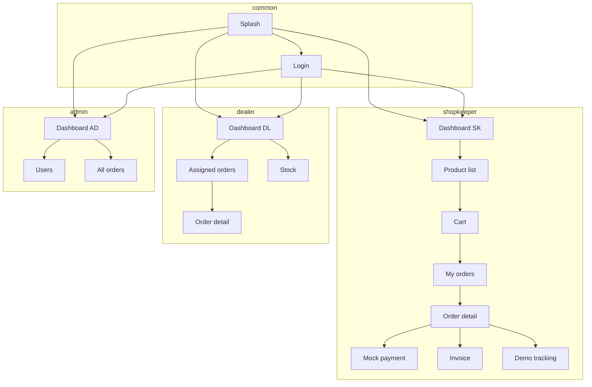

# Android app — Phase 1 (Investor demo)

Design for a **native Kotlin** client against the **NestJS** backend (`/Mart/backend`). Scope matches Phase 1: demo-ready UX, **server-authoritative** pricing (discount + GST), mock payment, simple PDF, **simulated** delivery tracking, light dashboards — no production hosting, full PG, or hardening.

---

## 1. Principles

| Principle | Implication |
|-----------|----------------|
| **Backend is source of truth** | Discount %, GST %, line totals, and order totals come from API responses. The app may show a **cart preview** using the same formulas only for UX; final numbers are always what the server returns after `POST /orders`. |
| **Role-based navigation** | After login, decode JWT `role` (or call `GET /auth/me`) and show **one primary home** per role (shopkeeper vs dealer vs admin/employee). |
| **Investor demo** | Prefer **clear labels**, **happy-path flows**, and **obvious status chips** over edge-case polish. |
| **No real GPS** | “Delivery tracking” = **demo timeline** + order status from API (`PENDING` → `ACCEPTED` → optional `DELIVERED`). |

---

## 2. Recommended stack

- **Language:** Kotlin  
- **UI:** Jetpack Compose + Material 3  
- **Architecture:** MVVM (or MVI) + `ViewModel` + `UiState`  
- **Async:** Kotlin coroutines + `Flow`  
- **Networking:** Retrofit + OkHttp + Moshi or Kotlinx Serialization  
- **Auth storage:** DataStore (encrypted preferred) or EncryptedSharedPreferences for `accessToken`  
- **DI:** Hilt (optional for Phase 1; manual constructor injection is acceptable for a thin demo)  
- **Images:** Coil (if product images are added later; Phase 1 can be icon + name only)  
- **PDF:** `android.graphics.pdf.PdfDocument` for a **1–2 page** invoice, **or** generate HTML in a `WebView` and use **Print to PDF** (faster to polish for demo)  
- **Navigation:** Navigation Compose with a **sealed role graph** or separate start destinations per role  

**Min SDK:** 26+ recommended (simpler security/crypto APIs). **Target:** latest stable.

---

## 3. App modules (logical)

```
app/
  ui/           # Composables, theme, navigation
  feature/
    auth/
    catalog/    # product list, detail
    cart/       # shopkeeper: build order
    orders/     # list, detail, actions by role
    payment/    # mock payment screen
    invoice/    # view + export PDF
    tracking/   # demo timeline
    dashboard/  # role dashboards
  data/
    api/        # Retrofit services, DTOs
    session/    # token, user, logout
  domain/       # optional: mappers, use cases
```

Keep **DTOs aligned** with backend JSON (Decimal fields as `String` in JSON → map to `BigDecimal` in Kotlin if you need math on device).

---

## 4. Information architecture & navigation

### 4.1 Entry

1. **Splash** → if token valid → **Role home**; else **Login**.  
2. **Login** → `POST /auth/login` → persist token + user → **Role home**.

### 4.2 Role → primary destinations

| Role | Primary home (dashboard) | Other tabs / sections |
|------|---------------------------|------------------------|
| **SHOPKEEPER** | “My orders” + quick “New order” | Products, Cart/checkout, Mock pay, Invoice, Demo tracking |
| **DEALER** | “Orders to fulfill” (incoming) | Stock (read), Confirm order, (optional) mark delivered for demo |
| **ADMIN / EMPLOYEE** | “Overview” KPIs | Users list, Areas / assignments (read), All orders, Invoices |

Use a **bottom bar** or **navigation rail** with 3–4 items max for demo clarity.

### 4.3 Navigation graph (high level)



---

## 5. Functional requirements (Phase 1)

### 5.1 User authentication

- **Role-based login:** Super Admin, Employee, Dealer, Shopkeeper.  
- **Credentials:** secure sign in with `email + password` (mobile/email input can be added as a future extension if backend adds mobile auth endpoint).  
- **Role-based access control:** server-side RBAC via guards; client-side role navigation hides unauthorized modules.  
- **Profile / me:** show name, email, role (from JWT or `GET /auth/me`).

### 5.2 Product management

Super Admin can:

- Add / edit / delete products.  
- Set per-SKU `Price`, `GST %`, and discount percentages.  
- Configure brand-specific discount behavior and category metadata.

Current API/UI support:

- `GET /products` for listing by role.
- `POST /products`, `PATCH /products/:id`, `DELETE /products/:id` for admin management.
- Discount fields available in product model (`dealerDiscount`, `shopkeeperDiscount`) and applied server-side in order pricing.

Planned extension (post-Phase 1 hardening):

- Upload SKU sheet (Excel/CSV).
- Product image upload pipeline and media hosting.
- Rich product category management UI (beyond lightweight metadata).

Discount rule baseline:

- Dealers: default 10% (configurable per SKU/admin settings).
- Shopkeepers: default 5% (configurable per SKU/admin settings).
- Other brands: admin-configurable discount.

### 5.3 Order placement (SHOPKEEPER)

- **Cart:** lines = `productId`, `quantity`.  
- **Place order:** `POST /orders` body `{ "items": [ { "productId", "quantity" } ] }`.  
- **Confirmation screen:** show returned `totalAmount`, `discountAmount`, `gstAmount`, `finalAmount`, `status`, assigned `dealerId` (and dealer name if included in response — if not, follow-up `GET /orders`).

**Discount / GST:** Display **exactly** the server response. Optional: before submit, show “Estimated” using the same rules as the backend for UX only, labeled “estimate”.

### 5.4 Mock payment

- After order created (`PENDING`): button **“Pay (demo)”** → `POST /orders/{id}/payment/mock` → show success animation + message from API (`MOCK` / `SUCCESS`).  
- No card UI required; optional fake “Processing…” 800ms delay for drama.

### 5.4 Area & dealer assignment

- Admin defines geographical areas.
- Each area is assigned to one dealer.
- Shopkeepers map to dealer through area.
- Orders from shopkeepers auto-route to assigned dealer.

Current mapping path:

- `Area.dealerId` binds an area to a dealer.
- Shopkeeper has `areaId`.
- Order creation resolves dealer from shopkeeper area on server.

### 5.5 Order management

#### Shopkeeper flow

- Browse products.
- Add to cart.
- View discounted price.
- GST calculated.
- Checkout.
- Online payment (mock in Phase 1 via API endpoint).
- Order confirmation.

#### Dealer flow

- Receive order in queue.
- View order details.
- Accept/confirm order.
- Update delivery status (demo tracking flow).
- Mark delivered (as endpoint/state support is enabled).

#### Super Admin flow

- View all orders.
- Filter by dealer/shopkeeper/date (progressive enhancement on top of list APIs).
- View sales performance and revenue cards.

### 5.6 Dealer / ops — confirm & stock

- **Order queue:** `GET /orders` (scoped by role on server).  
- **Confirm:** `PATCH /orders/{id}/confirm` — show stock errors if API returns conflict.  
- **Stock view:** `GET /stock` — list product + quantity for logged-in dealer (server-scoped).

### 5.7 Basic invoice PDF

- **Data:** `GET /invoices/by-order/{orderId}` (after confirm generates invoice server-side) — use returned JSON (invoice number, dates, order lines).  
- **PDF generation (pick one):**  
  - **A — PdfDocument:** draw title, table of lines, totals; save to `cache` + **Share** intent (investors love “Share PDF”).  
  - **B — WebView + print:** HTML template filled from JSON → Android print / save as PDF.  
- **Scope:** 1–2 pages, company name from static demo config or from order payload.

### 5.8 Demo delivery tracking

- **No GPS.** UI: vertical **stepper** or **timeline**:  
  - Placed → Payment (mock) OK → Confirmed by dealer → Out for delivery (demo) → Delivered.  
- **State source:** map `Order.status` from API (`PENDING`, `ACCEPTED`, `DELIVERED`). For steps without API yet, use **local demo flags** or time-based auto-advance **only in demo build** (clearly labeled “Demo mode”).  
- Optional: `PATCH` for `DELIVERED` if/when backend adds it; otherwise a **“Simulate delivery complete”** button (demo only) that calls a future endpoint or updates local state for the pitch.

### 5.9 Basic dashboards

- **SHOPKEEPER:** count of open orders, last order amount, quick link to catalog.  
- **DEALER:** pending confirmations count, low-stock hint (client-side: quantity &lt; threshold).  
- **ADMIN / EMPLOYEE:** total users (from `GET /users`), total orders in list length, optional sum of `finalAmount` computed client-side from `GET /orders` for demo — label “Demo totals”.  

Avoid building a charting library for Phase 1; **cards + lists** are enough for investors.

---

## 6. API mapping (current backend)

Configure **BuildConfig** / `local.properties` for base URL, e.g. emulator: `http://10.0.2.2:3000/`.

| Feature | Method | Path | Notes |
|--------|--------|------|--------|
| Login | POST | `/auth/login` | Body: `email`, `password` |
| Current user | GET | `/auth/me` | Bearer token |
| Products | GET | `/products` | Bearer |
| Orders list | GET | `/orders` | Scoped by role |
| Create order | POST | `/orders` | Shopkeeper; body `items[]` |
| Confirm | PATCH | `/orders/:id/confirm` | Dealer / admin / employee |
| Mock pay | POST | `/orders/:id/payment/mock` | Demo |
| Invoice doc | GET | `/invoices/by-order/:orderId` | After invoice exists |
| Invoices list | GET | `/invoices` | Scoped |
| Stock | GET | `/stock` | Dealer-focused scope |
| Users | GET | `/users` | Admin / employee |
| Areas | GET | `/areas` | Admin / employee / dealer |
| Assignments | GET | `/dealer-assignments` | Read model |

Use **Interceptor** to attach `Authorization: Bearer <token>` and optionally a **401** handler → clear session → Login.

---

## 7. Data models (sketch)

Align field names with JSON from Nest/Prisma (decimals often serialized as strings).

```kotlin
// Examples — adjust to actual JSON keys from your API
data class LoginRequest(val email: String, val password: String)
data class LoginResponse(val accessToken: String, val user: UserSummary)
data class UserSummary(val id: String, val name: String, val email: String, val role: String)

data class ProductDto(
  val id: String,
  val name: String,
  val brandType: String,
  val basePrice: String,
  val gstPercentage: String,
  val dealerDiscount: String,
  val shopkeeperDiscount: String,
)

data class CreateOrderRequest(val items: List<OrderItemReq>)
data class OrderItemReq(val productId: String, val quantity: Int)
```

---

## 8. Security & config (Phase 1 appropriate)

- **HTTPS** when you deploy a demo server; for local dev, `networkSecurityConfig` cleartext to `10.0.2.2` only in **debug** build.  
- **Token:** don’t log tokens; clear on logout.  
- **No** root detection or certificate pinning required for Phase 1 (call out as post-demo).

---

## 9. Build variants

- **`demo`:** mock delivery stepper auto-progress, extra labels “Simulated”.  
- **`staging`:** only real API + real statuses.  

Same codebase; `BuildConfig.DEMO_MODE` toggles UI behavior.

---

## 10. Investor demo script (5–7 min)

1. Login as **shopkeeper** → browse products → add to cart → place order → show totals/discount/GST from server.  
2. Mock payment success.  
3. Login as **dealer** → see order → confirm → show stock decrement message if you surface refreshed stock.  
4. Open **invoice** → generate/share PDF.  
5. Show **tracking** timeline (demo).  
6. Login as **admin** → dashboard counts → users list.  

**Demo logins, stable user IDs, and tab-by-role mapping:** see [`demo-accounts-and-dashboards.md`](./demo-accounts-and-dashboards.md) (seed: `Mart/backend/prisma/seed.ts`).

---

## 11. Out of scope (Phase 1)

- Production hosting, CI/CD, Play release hardening  
- Real payment SDK (Razorpay/Stripe, etc.)  
- Analytics pipelines, crash reporting beyond basic  
- Full RBAC on every screen (server already enforces; client can hide menus only)  
- Real-time GPS / maps  

---

## 12. Next implementation step

1. Create Android Studio project (**Empty Compose Activity**).  
2. Add Retrofit + OkHttp logging (debug only).  
3. Implement **Auth** + **Products** + **Orders** + **Mock payment** end-to-end against your running backend.  
4. Add PDF + dashboard + tracking UI.

If you want this repo to contain a **`android/`** module with package name, theme, and the first Retrofit interfaces generated from this doc, say the word and specify **applicationId** (e.g. `com.mart.distribution.demo`).
